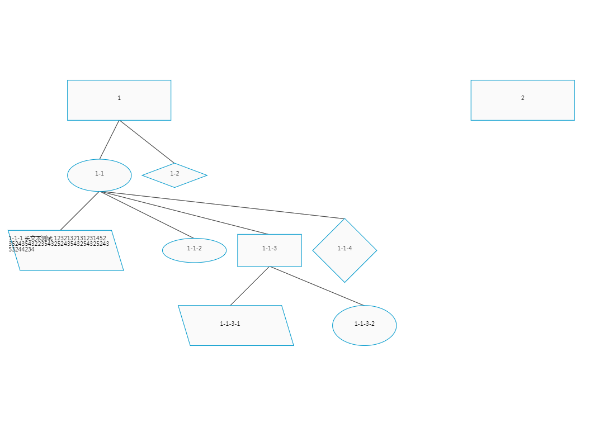

# ColorData
Data Visualization with canvas and d3

# 数据可视化

* 基于canvas/svg

* 关系拓扑图

* 流程逻辑图

* json数据结构化

* 节点数据刷新图像重绘(diff算法)

# 应用条件

需要将json数据的派生结构 转换为 可视化数据图形

# 例子

```javascript
const data=[
  {
    name: `node-${new Date().getTime() * Math.random()}`, // 节点图名称/id
    text: '', // 图中显示字样
    isShow: true, // 是否默认显示图
    type: 0, // 0:方框图 1:菱形图 2:椭圆图 3:四边形图
    value: null,  // 节点图所代表值 [object | string | number | boolean]
    events: {
      'mousedown':function(data,_ev){}, // 绑定事件名 : 绑定事件(冗余参数，事件对象)
    },  // 节点图所绑定事件
    x: 0, // 节点图中心点x坐标值
    y: 0, // 节点图中心点y坐标值
    width: 160, // 节点图宽度
    height: 40, // 节点图高度
    children: [], // 节点图子节点
  }
];
```

当json数据输入给本插件，由本插件转化为可视化拓扑图像

# 测试

基于三大框架(vue/angular/react)搭建的平台中，进行测试和项目优化

# 使用

* 最终效果



* 安装依赖 `npm install color-data --save-dev`

* 使用

```html
<div id="color-data" style="width:100%;height:800px;"></div>
```

```javascript
new ColorData({
      container: '#color-data',
      data: [
        {
          text: '1',
          width: 260,
          height: 100,
          children: [
            {
              text: '1-1',
              type: 2,
              width: 160,
              height: 80,
              children: [
                {
                  text: '1-1-1 长文本测试 12321321312314523524354322354325243543254325243532442342',
                  type: 3,
                  width: 260,
                  height: 100,
                },
                {
                  text: '1-1-2',
                  type: 2,
                  width: 160,
                  height: 60,
                },
                {
                  text: '1-1-3',
                  width: 160,
                  height: 80,
                  children:[
                    {
                      text: '1-1-3-1',
                      type: 3,
                      width: 260,
                      height: 100,
                    },
                    {
                      text: '1-1-3-2',
                      type: 2,
                      width: 160,
                      height: 100,
                    },
                  ],
                },
                {
                  text: '1-1-4',
                  type: 1,
                  width: 160,
                  height: 160,
                }
              ]
            }, {
              text: '1-2',
              type: 1,
              width: 160,
              height: 60,
            }
          ]
        },

        {
          text: '2',
          width: 260,
          height: 100,
        }
      ]
    });
```